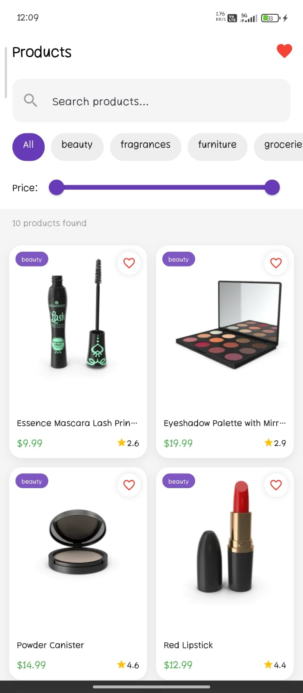
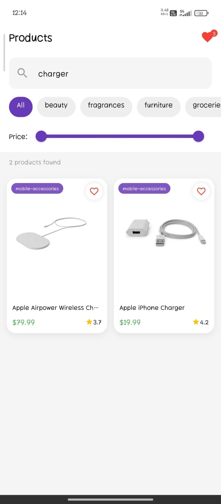
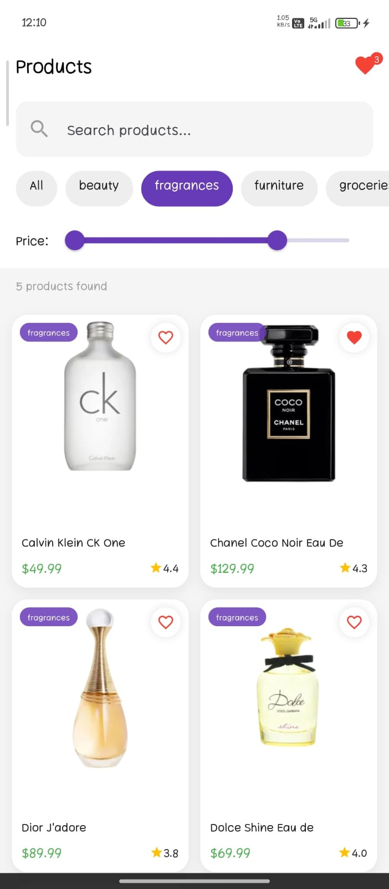
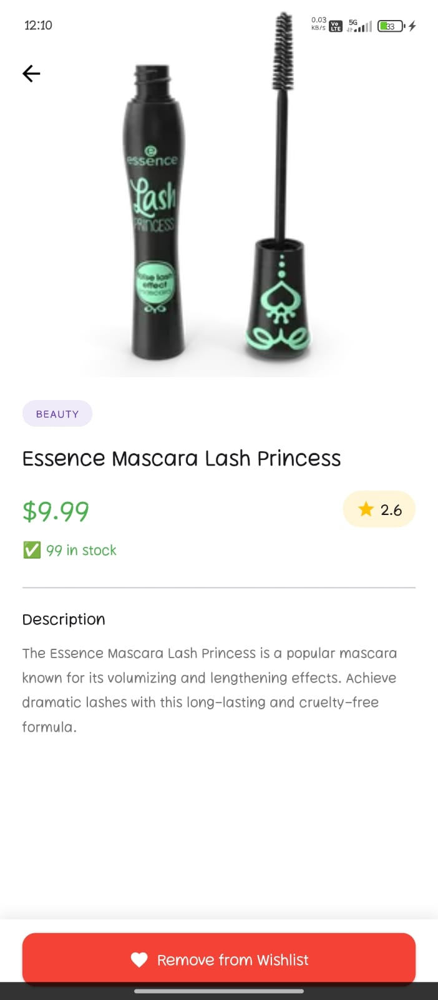
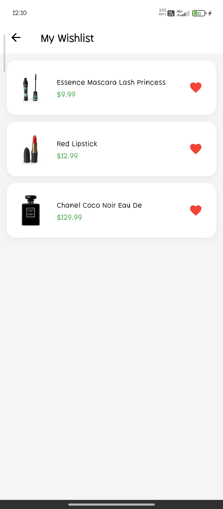
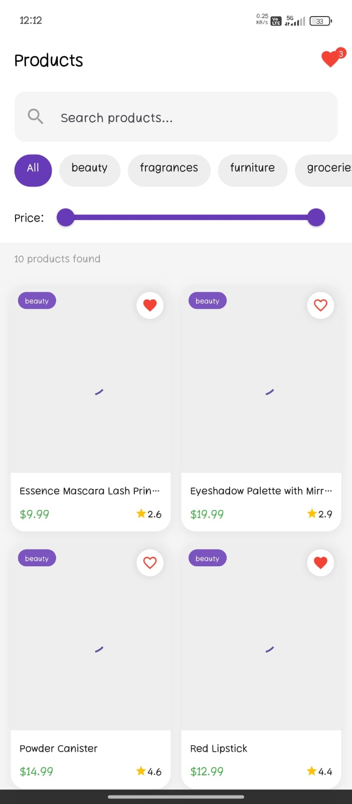
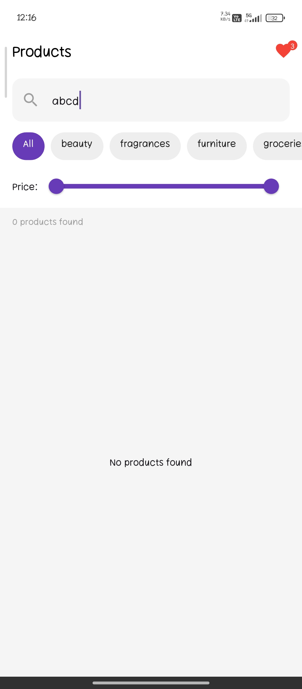

# 🛍️ Flutter Product App (Assignment Submission)

This project was built as part of a Flutter internship assignment. The goal was to create a product listing app using a real API, along with search, filters, pagination, and some DSA problems.

---

## 📌 Assignment Reference

The assignment required:

* API integration with product listing
* Search functionality
* Filtering (category + price)
* Pagination (infinite scroll)
* Product detail screen
* Bonus: Wishlist (local storage)
* DSA questions in Java

As described in the assignment document .

---

## 🚀 Features Implemented

### 🔹 API Integration

* Fetches products from: https://dummyjson.com/products
* Displays product image, title, price, rating

### 🔹 Search (with Debounce)

* Search by product name
* Implemented using a custom Debouncer class
* Prevents unnecessary API calls

### 🔹 Filters

* Category filter (horizontal scroll chips)
* Price range slider

### 🔹 Pagination (Infinite Scroll)

* Loads more products when scrolling
* Uses `skip` + `limit`
* Prevents duplicate calls using `isLoading` and `hasMore`

### 🔹 Product Detail Screen

* Full product image
* Price, rating, description
* Wishlist toggle

### 🔹 Wishlist (Bonus)

* Add/remove products
* Stored using SharedPreferences
* Works even after app restart

### 🔹 UI/UX

* Clean card layout
* Loading shimmer effect
* Empty state handling
* Responsive grid

---

## 💻 Part 2 — DSA (Java)

Located in:

```
dsa_java/JavaSolutions.java
```

Problems solved:

1. **Two Sum Variant (Optimized O(n))**
2. **Longest Substring Without Repeating Characters**
3. **Reverse String (without built-in methods)**
4. **Find Duplicate Elements in Array**

---

## 🧪 Part 3 — Practical Questions

### Q1: API + List

* Implemented in `api_service.dart`
* Data fetched and mapped to model

### Q2: Pagination

* Implemented in `product_provider.dart`
* Infinite scroll logic added

### Q3: Debounce

* Implemented using custom class:

```
lib/part3_dart/part3_dart.dart
```

---

## 📸 Screenshots

### 🏠 Home Screen



### 🔍 Search



### 🎯 Category Filter



### 📄 Product Detail



### ❤️ Wishlist



### ⏳ Loading State



### ❌ Empty State



---

## 🏗️ Project Structure

```
lib/
 ├── models/
 ├── providers/
 ├── services/
 ├── screens/
 ├── widgets/
 ├── part3_dart/
 └── main.dart

assets/
 └── screenshots/

dsa_java/
 └── JavaSolutions.java
```

---

## ⚙️ Setup Instructions

1. Clone the repo:

```
git clone <your-repo-link>
```

2. Install dependencies:

```
flutter pub get
```

3. Run the app:

```
flutter run
```

---

## 🧠 Approach

* Used **Provider** for state management
* Clean separation of:

  * API layer
  * UI layer
  * State management
* Focused on:

  * performance (debounce + pagination)
  * user experience (loading + empty states)

---

## 📊 Evaluation Criteria Covered

* Code Quality ✅
* UI/UX ✅
* API Handling ✅
* DSA ✅
* Architecture ✅

---

## 🙌 Final Note

This project was built with a focus on simplicity, clean structure, and real-world usability. Tried to keep the code readable and scalable.

---

## 👤 Author

**Arun Kumar**
Flutter Developer (Learning & Building 🚀)

---
